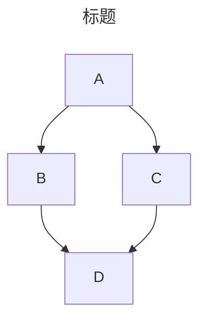
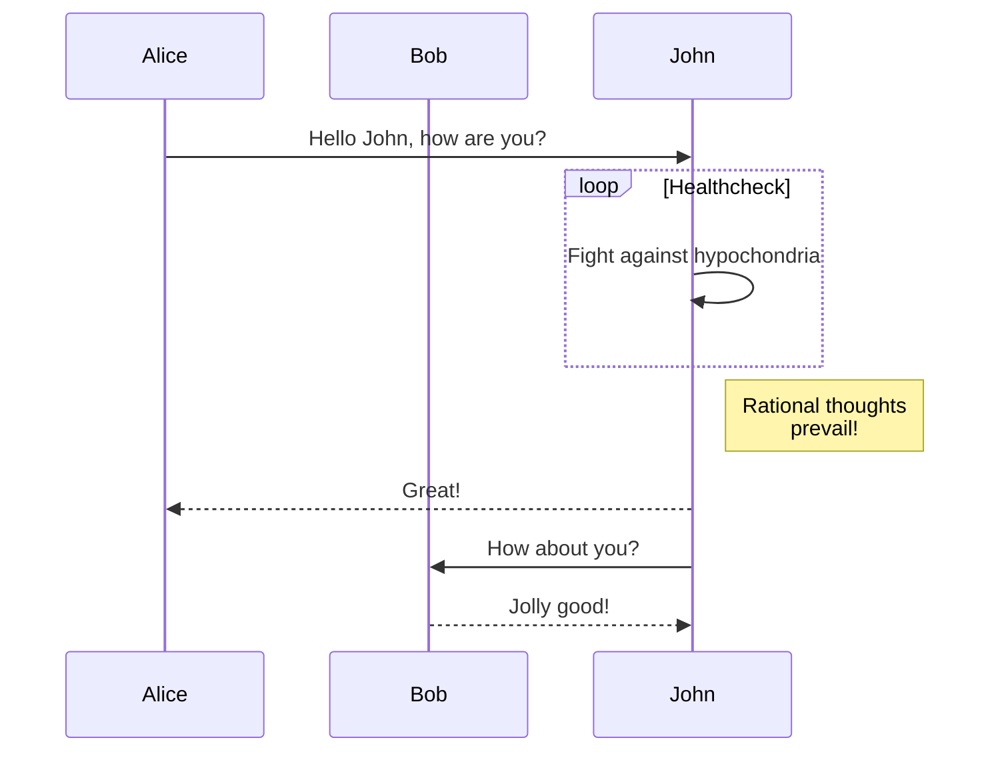
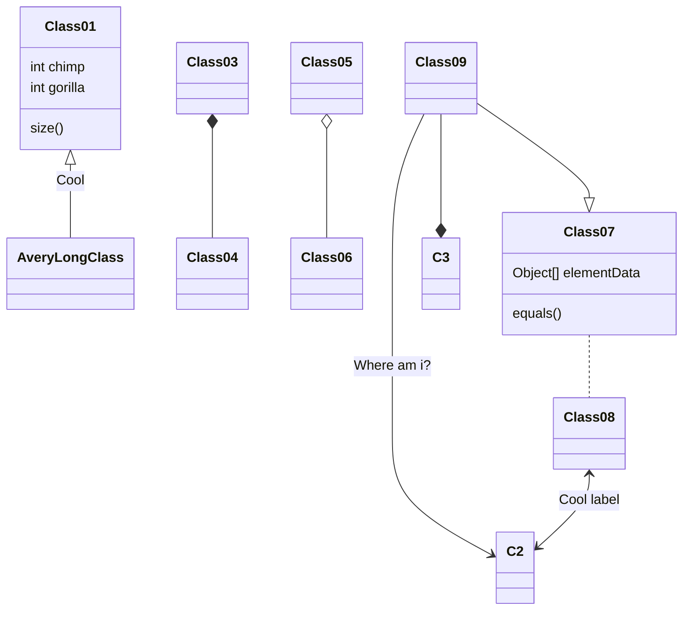

# 简介

该篇文章记载本站文章如何支持mermaid渲染。

# 实操

1. 在需要使用mermaid的界面中插入以下脚本，本站在post.html公共代码部分进行插入

   ```html
   <script type="module">
       import mermaid from 'https://cdn.jsdelivr.net/npm/mermaid@10.0.2/+esm';
       mermaid.initialize({ startOnLoad: false });
       await mermaid.run({
         querySelector: '.language-mermaid',
       });
   </script>
   ```

# 测试

用例1




用例2



用例3



更多用例请参考[mermaid官网](https://mermaid.js.org/intro/)
