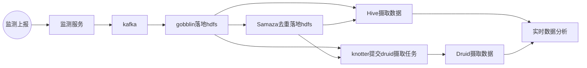
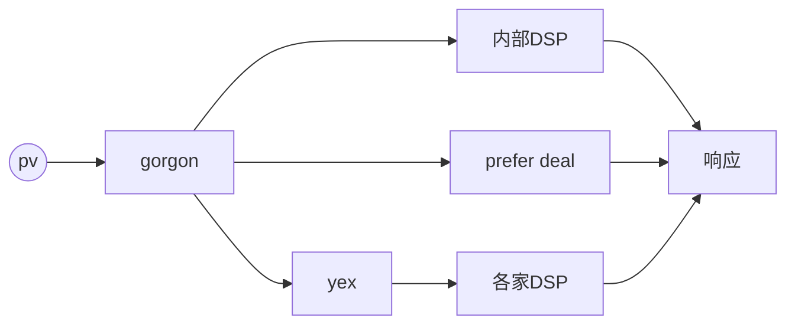

# 名词认识

1. CPC(cost per click)：每次点击花费，24小时内同一IP只算一个
2. CPM(cost per mille)：每千次展示花费
3. CPL(cost per lead)：让客户点击广告，lead到广告商的指定网页页面，24小时内同一IP只算一个有效lead
4. CPA(cost per action)
5. CPS(cost per sale)
6. CPR(cost per response)：以在固定时间内展示，然后及时的获得相应客户的问题回应结果或者拨打电话，这种以电视广告购物为主，在互联网上应用不多。
7. CPT(cost per time)：网站上某个广告位置，以时间单位展示收费和电视台的夜间广告很相似。
8. CPD(cost per download)：以引导客户下载为计费标准，CPA的一种形式。
9. CPI(cost per install)：引导客户安装为计费标准，也是action的一种只是更加细化了。

**DSP（Demand-Side Platform）需求方平台**

比如小米想要投放一个新机发布的广告，那么他想在各大网站如网易、新浪UC等地方投放这条新机信息，但他不可能一个一个的去谈，费时费财不说，效率非常低。
于是他就去了一个平台，把打广告的钱冲进去，也就是广告费，然后在这个平台里选择投放的媒体，比如UC、新浪、网易等，然后跟淘宝一样的完成结算。
OK，这类似于淘宝的平台就是DSP，里面有很多的ssp提供的媒体
小米把钱冲进去了，DSP平台几乎实时给他提供了曝光量、CPM(千人曝光成本)、点击量等等数据，而他啥都不用干，喝喝咖啡就行，效果好久追加费用，效果不好就暂停投放。

**RTB（Real Time Bidding）实时竞价**

当小米把UC头条的某个广告位买下来的同时，也有好多其他的购买者也买了这个广告位，比如华为刚好也有新机发布，也买了这个广告位，那么这个广告位在展示的时候，到底展示谁的广告呢?这就是实时竞价了，谁当前给的广告位费用高，UC就展示谁的，广告计算方式有CPC、CPI、CPA等方式。这个竞价是在100ms内完成的。

**SSP（Sell-side Platform）供应方平台**

供应方就很简单了，比如以上的UC、网易、新浪什么的可以提供广告位的都是供应方，也就是一个个的媒体了

**ADX（AD Exchange） 广告实时竞价交易平台**

ADX很简单了，上面提到的RTB，实际上整个竞价过程就是在ADX上完成的，即就是毫秒竞价

# 业务流程

