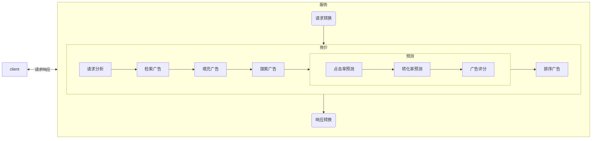

# 什么是DSP

DSP：全称“Demand-Side Platform”，需求方平台，是为广告主、代理商提供一个综合性的管理平台，通过统一界面管理多个数字广告和数据交换账户。

# 请求链路

整体的一个请求链路如图所示。图中的流量方可能是SSP(媒体提供方)，例如各种APP。也有可能是ADX(广告交易平台)，例如网易的Yex。

从这个请求链路中可以看出，DSP是流量方和需求方的中点，将两者串联起来，完成一个广告投放链路。

# DSP广告投放流程

## 请求响应转换

DSP作为一个开放的广告的平台，支持各种外部流量的广告请求，在实际业务过程中，会存在外部媒体根据我们的协议进行对接，这种情况，我们系统可以做到无感知，但是对于一些媒体，没有接入的技术能力，那么会由我们内部进行排期接入。

外部流量的接入，一般分为以下几个步骤：

1. 合同签订
2. 媒体入库
3. 流量接入

## 竞价

**请求分析**

主要分析的数据包括设备号的各种信息（例如性别，年龄，职业等等），请求来源，IP地址，请求的广告位，场景等等一系列指标，用于后续的广告检索。

**检索广告**

1. 根据请求得出后补的广告位列表
2. 根据请求分析得到的特征数据，对广告进行筛选，常见的特征数据包括年龄，性别，应用安装列表，系统，场景，设备等等。我们项目中是使用bitMap，把满足以上特征的所有广告通过交集的方式提取出来。然后将第一步得到的广告候选列表和bitMap求交，得出实际的候选列表
3. RTA广告还需要向外部广告商询问是否参竞，若不参竞则过滤掉该候选广告

**填充广告**

第二步检索广告实际上只获得了广告的key值，此时，我们需要将广告物料填充完整，填充的内容包括广告限价，ocpc相关内容，转换跟踪链接，cpa，过去七天数据等等，总而言之就是后续的排序需要用到的一系列数据。

**探索广告**

我们需要根据以往投放的效果来决定后续的出价，这就会导致新的广告无法做预测，我们采取explore机制来帮助新的广告投放，并且产生数据作用于后续的预测，举个简单的例子，这个新的广告用了老的广告素材，那么就可以将老的广告素材之前投放的广告作用新广告的投放效果。

- 对于有新广告的请求，一定概率启用探索（eg：10%）；
- 探索时，挑选展示量最低（首要条件）的广告打flag（次要条件待定）；

**预测**

1. 根据之前得到的广告物料，进行点击率预测，常见的模型有LR模型(粗排模型)和FFM模型/DNN模型（精排模型），调用方式通常有两种，一种是直接调用模型，第二种是通过RPC的方式去远程调用算法服务
2. 转化率预测
3. 打分，根据上述的一系列数据对候选广告进行打分

**排序广告**

根据上述的打分对广告进行排序，选出需要的广告。

在这一步实际上可能还有一些别的操作，例如设置广告二价，实际出价，系数调价等等。
