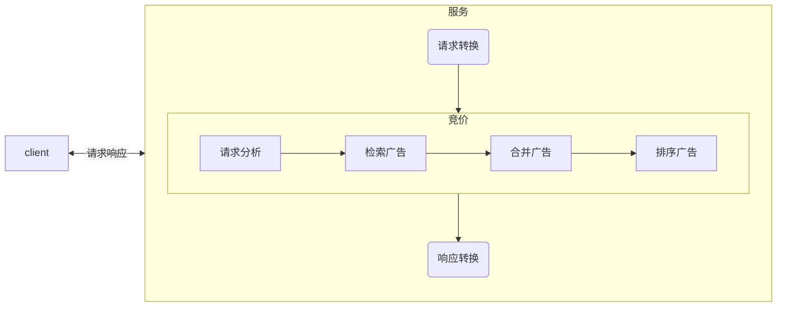

# 什么是DSP

DSP：全称“Demand-Side Platform”，需求方平台，是为广告主、代理商提供一个综合性的管理平台，通过统一界面管理多个数字广告和数据交换账户。

# 请求链路

整体的一个请求链路如图所示。图中的流量方可能是SSP(媒体提供方)，例如各种APP。也有可能是ADX(广告交易平台)，例如网易的Yex。

从这个请求链路中可以看出，DSP是流量方和需求方的中点，将两者串联起来，完成一个广告投放链路。

# DSP广告投放流程

## 请求响应转换

DSP作为一个开放的广告的平台，支持各种外部流量的广告请求，在实际业务过程中，会存在外部媒体根据我们的协议进行对接，这种情况，我们系统可以做到无感知，但是对于一些媒体，没有接入的技术能力，那么会由我们内部进行排期接入。

外部流量的接入，一般分为以下几个步骤：

1. 合同签订
2. 媒体入库
3. 流量接入

## 竞价

**请求分析**

主要分析的数据包括设备号的各种信息（例如性别，年龄，职业等等），请求来源，IP地址，请求的广告位，场景等等一系列指标，用于后续的广告检索。

**检索广告**

1. 根据请求的广告位，初筛出广告候选列表
2. 根据请求分析得到的特征数据，对广告进行筛选
3. 
