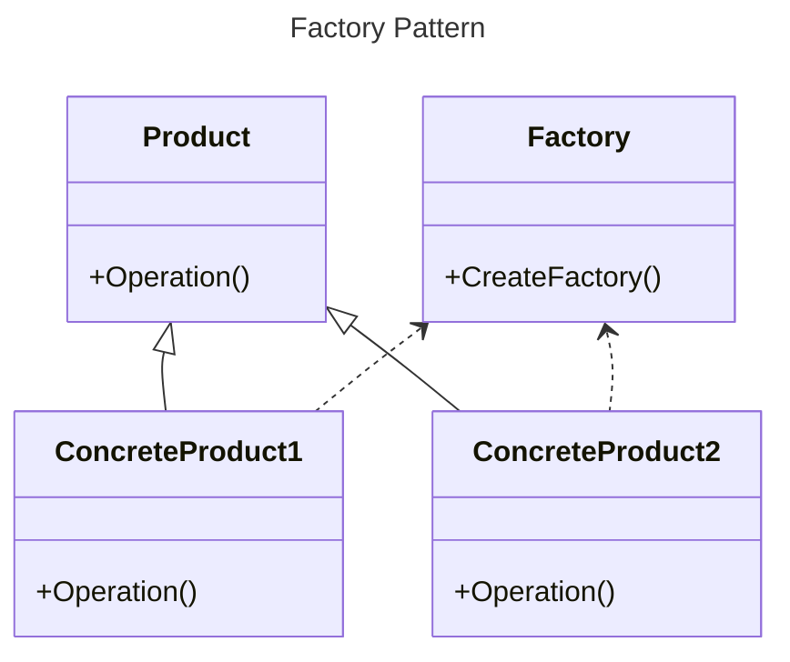
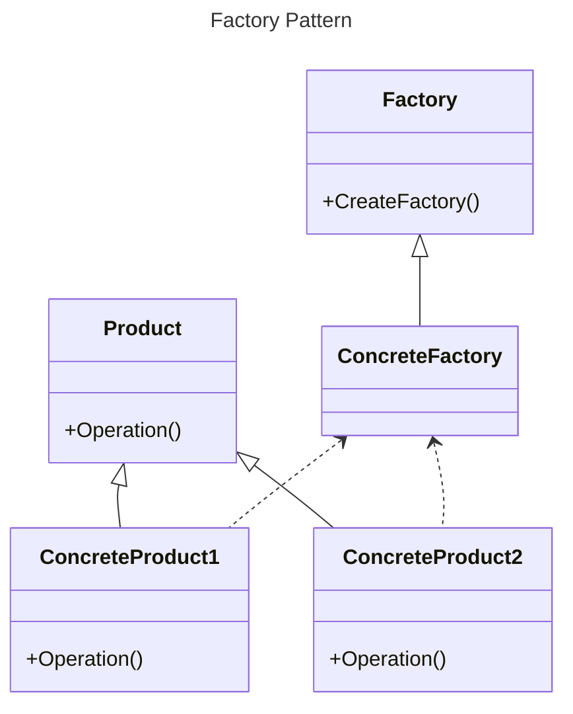
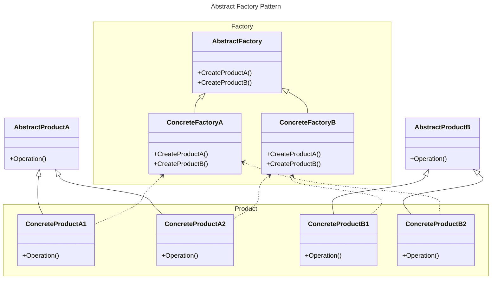
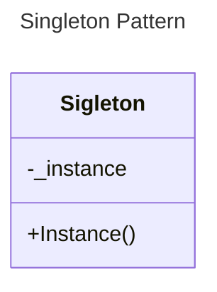
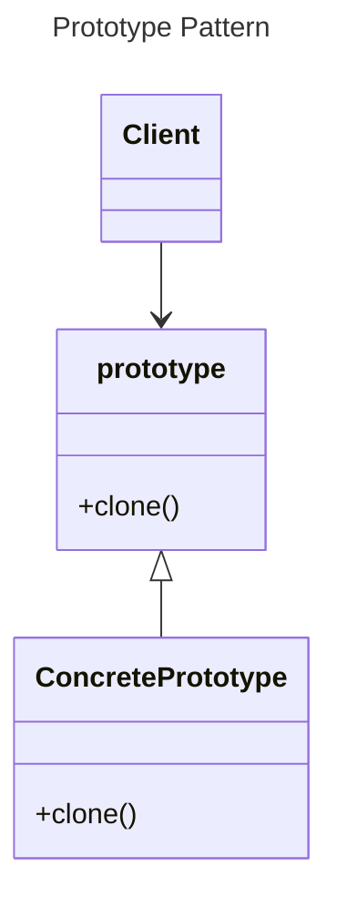

# 工厂模式

## 场景

1. 为了高内聚低耦合，我们常常抽象出一些公共父类或者接口，利用多态的特性提高程序的扩展性，但是日积月累下，会出现非常多的子类，甚至由于名称冲突，类的命名可能充满迷惑性，这也会带来两个问题。
   1. 客户程序必须知道子类的名称
   2. 程序的扩展性和维护越来越困难
2. 在抽象类A中不知道实际要新建的对象，而A的子类知道。

## 功能

1. 创建定义对象的接口，封装了对象的创建
2. 使得具体化类的工作延迟到了子类中

## 类图

这可以用于解决第一种场景，工厂模式提供了一个创建对象的接口。

以下这种实现可以延迟子类实例化

## 缺点

每个工厂只能创建一种特定类及其子类，如果要为不同类提供创建对象接口，就要用AbstractFactory。

# 抽象工厂模式

## 场景

在关卡游戏中，有大量的怪物，各级关卡需要创建对应级数怪物，游戏系统中会有成百上千的怪物类，要保证创建不出错。

## 类图

## 总结

AbstractFactory 模式是为创建一组(有多类)相关或依赖的对象提 供创建接口，而 Factory 模式正如我在相应的文档中分析的是为一类对象提供创建接口或延 迟对象的创建到子类中实现。

# 单例模式

单例模式非常简单，它的作用就是创建一个唯一的对象。

## 类图

通过一个static接口提供对象。

# 建造者模式

**优点：**

- 分离构建过程和表示，使得构建过程更加灵活，可以构建不同的表示。
- 可以更好地控制构建过程，隐藏具体构建细节。
- 代码复用性高，可以在不同的构建过程中重复使用相同的建造者。

**缺点：**

- 如果产品的属性较少，建造者模式可能会导致代码冗余。
- 建造者模式增加了系统的类和对象数量。

**场景**

1. Java lombok的@Builder就是建造者模式
2. Avro，protoBuf等IDL生成的Java对象，也是通过建造者模式去构造对象，在build的时候做各种复杂的校验

# 原型模式

## 作用

Prototype 模式提供了一个通过已存在对象进行新对象创建的接口(Clone)。

## 类图

